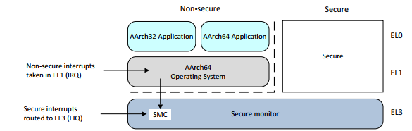
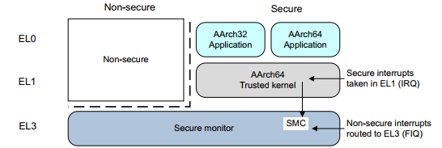
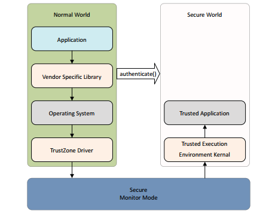
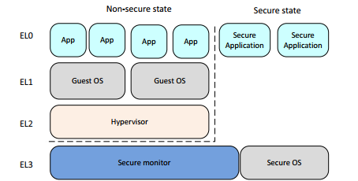
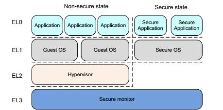

# 一文读懂ARM安全性架构和可信系统构建要素 

所谓可信系统（trusted system），即能够用于保护密码和加密密钥等资产（assets）免受一系列的可信攻击，防止其被复制、损坏或不可用（unavailable）。

安全性通常由保密性（confidentiality）、完整性（integrity）和可用性（availability）等原则定义。保密性是密码和加密密钥等资产的关键安全问题。防止篡改和保证真实性（authenticity）对于安全软件和用于安全领域片上保密至关重要。可信系统的实例可能包括移动支付的口令接口（entry of password），数字权限管理和电子票务。开放系统领域的安全更加难以做到，这些系统里你可以下载各种的软件到平台上，也可能无意间下载恶意（malicious）或不可信的的代码，那可能对你的系统有害。

移动系统能被用于看视频、听音乐、玩游戏、或者浏览网页和访问金融服务。这就意味着银行和用户或者服务提供商都要信任所使用的设备。设备中运行复杂的具有高级别连通性的操作系统，可能更易受到恶意软件的攻击。尽管你可以通过软件设计达成一定程度的安全性（acheieve some measure of security），但借助 CPU 和系统层级的内存分区（memory partitioning）能够获得更高级别的保护。

ARM 处理器中包含用于支持构建可信系统的硬件扩展。编写可信的操作系统或者可信的运行环境（TEE, trusted execution enviroment）系统不在此书的讨论范围内。但是，如果你通过设置安全分段实现 ARMv7 按安全拓展，注意这会对非特权代码（换句话说，不属于可信系统的代码）施加一些限制。

软件和硬件攻击可以分为一下几类：

```Software attacks```
恶意软件的攻击同好像不需要访问物理设备，可以利用操作系统或者应用中的漏洞。
```Simple hardware attacks```
这些攻击通常是被动的（passive），大多数是非破坏性的攻击，需要访设备并解除电子元件，使用常见的工具进行，比如逻辑探针和 JTAG

```Laboratory hardware attack```
这中工具需要精密和价格高昂的工具，比如 Focused Ion Bean （FIB）技术或者功耗分析技术、通常用于攻击智能卡设备（smartcard devices）。

TrustZone 技术是为了防护 software 和 simple hardware 攻击而设计的。

## 1 ARM 可信空间硬件架构（TrustZone hardware architecture）

TrusteZone 架构为设计人员提供一种方法，帮助他们利用TrustZone安全拓展和安全外设确保系统安全。底层程序员即使不使用安全特性，也应该理解TrustZone架构对系统的限制。

ARM 的安全模型将设备的软硬件资源划分为安全子系统（security subsystem）的 security world 和其他部分的 normal world。系统硬件保证隔离 secure world 和 normal world单项隔离，无法从 normal world 访问到 secure world 的任何从属资产。安全设计将所有的敏感器件放置在 secure world 中。理想情况下，运行健壮的软件可以保护资产免受各种可能的软件攻击。

ARM 架构参考手册用术语 secure 和 non-secure 指代系统的安全状态。non-secure 状态不意味着等效于存在安全漏洞，而是正常运行状态，与 normal world 一样。通常情况下，secure 状态和 non-secure 状态存在主从关系（master and slave relationship），并且只在 normal world 执调用（perform）secure monitor call (SMC) 才会运行于 secure world。world 一词不仅用于指明运行状态，还用于指代只在此状态下可访问的内存和外设。

架构新增功能意味着单个物理核（pysical core）可以以时间片的方式同时执行 secure world 和 non-secure world 的代码，尽管有赖于产生中断的外设，这些外设可以设置为仅能被 secure world 访问。例如，一个 secure world 的 timer 中断可被用于保证 secure worl 的执行时间， 其方式类似于抢占式的多任务处理（preemtive multitasking）。这种外设可能有，也可能没有，取决于平台的设计者打算支持的安全等级和用例。

或者，也可以使用更接近合作多任务的执行模型。在这种情况下，虽然就每个 world 可以访问的资源而言，secure world 与 normal world 是独立的，但执行时间的调度通常在两个 world 之间相互依赖。

类似于系统固件或者系统软件的其他部分，secure world 的软件必须注意最小化对系统其他部分的影响。例如，除非 normal world 调用一些行为请求，应该避免消耗大量的执行时间。non-secure 中断信号应该尽可能快地送达 normal world。这有助于确保正常世界软件的良好性能和响应能力，而无需进行大量移植。

内存系统通过附加伴随内存和外设地址1bit的方法划分。这 1bit 被称为 NS-bit， 指明访问是 secure 还是 non-secure。这 1bit 附加到所有的内存系统传输，包括 cache tags 和访问系统内存和外设。这 1bit 为 secure world 提供了地址空间，为 normal world 的提供了完全独立的地址空间。运行在 normal world 的软件只能发起 non-secure 内存访问，因为 core 在 normal world 产生的所有内存中都把 NS-bit 置为 1. 运行在 secure world 的软件通常做 安全内存访问（secure memory access），但是也能借助 页表 entries 中的 NS 和 NSTable flags 发起 non-secure 内存访问。

尝试对被标记为 secure 的 cache 数据执行 non-secure 访问会触发 cache miss。尝试对标记为 secure 的外部存储（external
memory）发起 non-secure 访问会被内存系统拒绝请求，从设备会返回 error respose。There is no indication to the Non-secure system that the error is caused by an attempted access to Secure memory。（从 non-secure system 访问 secure system 不会有特定的标记，只会被拒绝请求）。

在 aarch64 模式下，EL3 有自己的页表，通过 TTBR0_EL3 和 TCR_EL3 管理。secure world 中只允许 stage one translation，且没有TTBR1_EL3。

secure 和 non-secure entries 可以共存于 cahe 和 tlb 中。切换 secure/non-secure world 时不需要 invalidate cache line。normal world 只能产生 non-secure access，也只能命中标记为 non-secure 的 cache line。

TLB 中的 entries 记录了哪个 world 生成了特定 entry，虽然 non-secure world 永远不能对secure data 进行操作，但 secure world 可以在缓存中分配 NS 行。此外，每个异常级别的cache 都是单独启用和禁用的。cache 控制对于两个 world 是独立的，但对于所有异常级别却不是独立的，EL0 永远不能直接启用或禁用缓存，而 EL2 可以覆盖非安全 EL1 的行为。

## 2 通过中断切换安全模式

core 执行两个 world 中的代码，通过执行 SMC 指令或者硬件异常机制（比如中断）进行上下文切换（context switch）。ARM 处理器有两类中断， FIQ 和 IRQ。通过控制将异常和中断重定向到 EL3 的形式，明确支持安全中断，与当前的 DAIF 无关。不过，这些控制仅区分主要中断类型： IRQ、FIQ 和异步中断。更精细的控制要求将中断过滤为安全组和非安全组。要有效做到这一点，需要 GIC 的支持。

一个典型的用法是，通过在中断控制器内将secure interrupt source 映射为 FIQ，将 FIQ 用作安全中断。这种情况下相关外设和中断控制器寄存器必须标记为只能 secure access，以防止 normal world 重新配置这些中断。这些安全 FIQ 中断也必须路由到处于安全执行状态的处理程序。





使用安全扩展的操作系统通常有一个轻量级（light-weight）可信内核，在 secure world 中托管（thathosts）加密等安全服务。完整的操作系统在 normal world 中运行，并能使用 SMC 指令访问安全服务。这样，正常世界就能访问服务功能，而不会有 secure assets（如密钥材料或其他受保护数据）暴露给在 normal world 中执行的任意代码（arbitrary code）的风险。

## 3 多核系统的安全性 （security in multi-core system）

多核系统中的每个内核都具有本文所述的相同安全功能。集群（cluster）中任意数量的内核都可以在任何时间点在 secure world 中执行，并且内核可以在两个 world 之间独立转换。其他寄存器控制 normal
world 代码是否可以修改窥探控制单元（suc，scoop control unit）的设置。同样，考虑到安全问题，在多核集群中分配优先级中断的 GIC 也必须进行配置。

### 3.1 正常模式和安全模式之间的交互（interaction between normal and secure world）

一般来说，应用程序开发人员不会直接与安全扩展、TEE 或受信任服务交互。相反，他们会使用高级应用程序接口，例如由 normal world 库提供的 authenticate()。该库由与受信任服务（例如信用卡公司）相同的供应商提供，负责处理底层交互。下图以用户应用程序调用 API 的流程形式显示了这种交互，用户应用程序调用 API 后，会进行适当的操作系统调用，然后将调用传递给驱动程序代码，再通过 secure monitor 将执行结果传递给 TEE。



在 secure world 和 normal world 之间传递数据是很常见的。例如，在 secure world 中可能有一个签名检查器（signed checker）。normal world 可以使用 SMC 调用请求 secure world 验证下载更新的签名。 secure world 需要访问 normal world 使用的内存。 secure world 可以使用页表描述符中的 NS 位来确保使用 non-secure access 来读取数据。这非常重要，因为数据可能已经在缓存中，而 normal world 的访问都被标记为 non-secure。安全属性可视为一个额外的地址位。如果内核使用 secure memory access 尝试读取数据，则不会命中缓存中的 non-secure 数据。

对 normal world 的程序员而言，一般情况下可以忽略secure world 中发生的事情，因为它的运行对 normal world 是隐藏的。如果中断发生在安全世界，中断延迟可能会略有增加，但与典型操作系统的总体延迟相比，这种增加是很小的。此外，此类服务质量问题取决于 secure world 操作系统的良好设计和实现。

### 3.2 安全调试 （secure debug）

安全系统还能控制调试功能的可用性。可以为 normal 和 secure world 配置独立的硬件，通过完整的 JTAG 调试和跟踪控制（trace cotrol），这样就不会泄露受信任系统的信息。可以通过安全外设控制硬件配置选项，也可以使用以下信号对其进行硬连接和控制：

- 安全特权入侵调试启用 (SPIDEN)： JTAG调试
- 安全特权非侵入式调试启用 (SPNIDEN)： 跟踪和性能监控

## 4 切换安全状态 （switch between secure and non-secure state）

对于 ARMv7 安全扩展，软件可使用 monitor mode 在 secure 和 non-secure 状态之间切换。该模式是安全状态下其他特权模式的同级模式。

对于 ARMv8 体系结构，当 EL3 使用 AArch32 时，系统的行为与 ARMv7 完全兼容，结果是 secure 状态下的所有特权模式都被视为 EL3 模式。

AArch32 的安全模式如下图所示。在这种情况下，AArch32 使用 EL3 提供安全操作系统和监控器。



为了与 ARMv7 体系结构保持一致，安全状态 EL1 和 EL0 具有与非安全状态 EL1 和 EL0 不同的 VirtualAddress 空间。这样，ARMv7 32 位架构的安全侧代码就可以在非安全侧运行 64 位操作系统或管理程序的系统中使用。

下图显示 AArch64 使用 EL3 提供安全监控时的安全模式。EL3 状态不可用于 AArch32，但 EL1 可用于安全操作系统。当 EL3 使用 AArch64 时，EL3 级用于执行负责在非安全状态和安全状态之间切换的代码。

